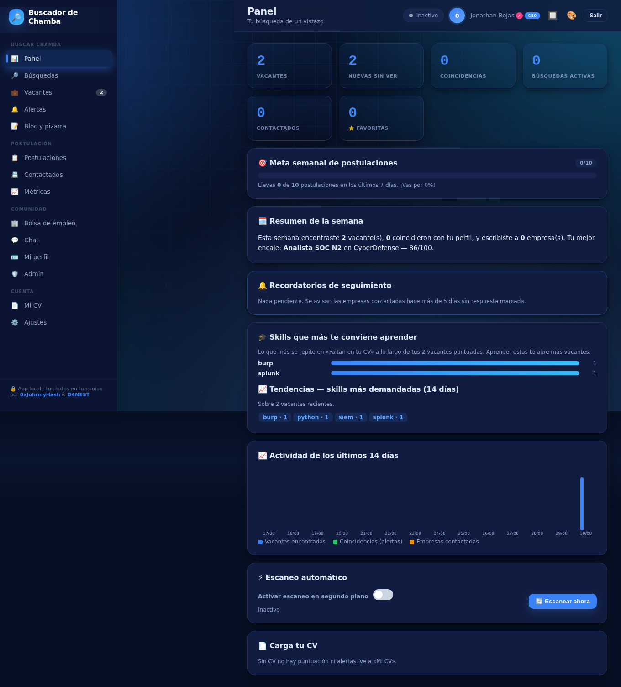
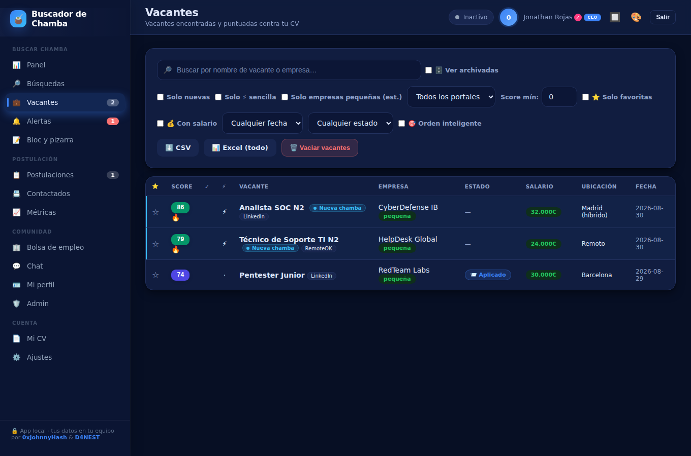
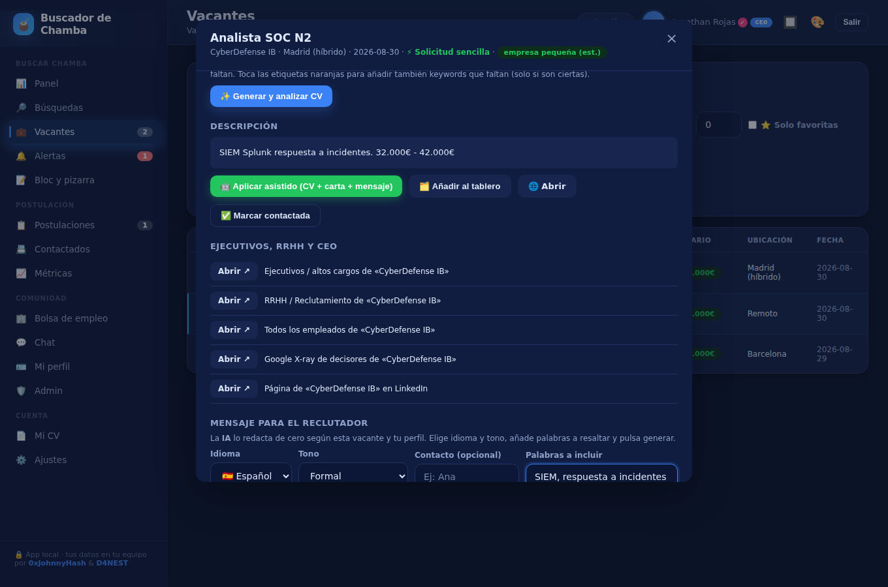
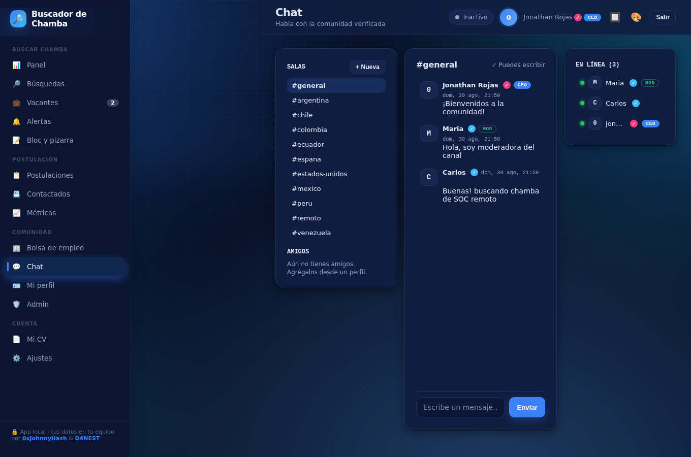
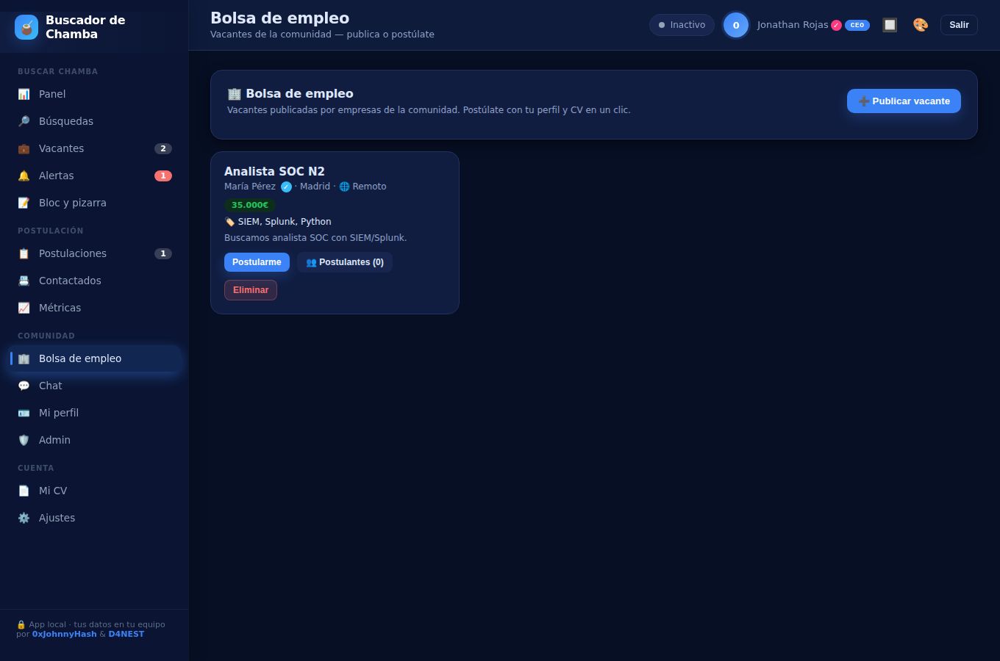
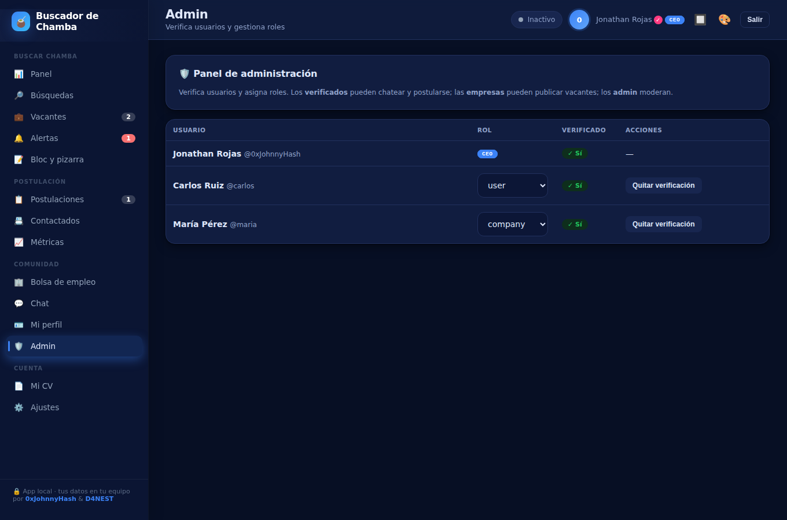
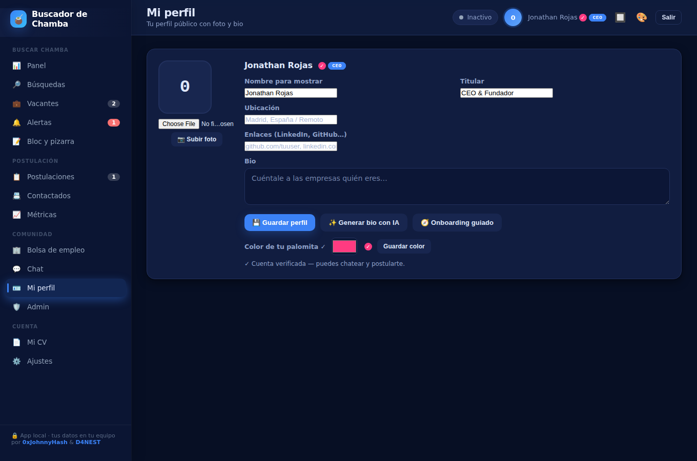
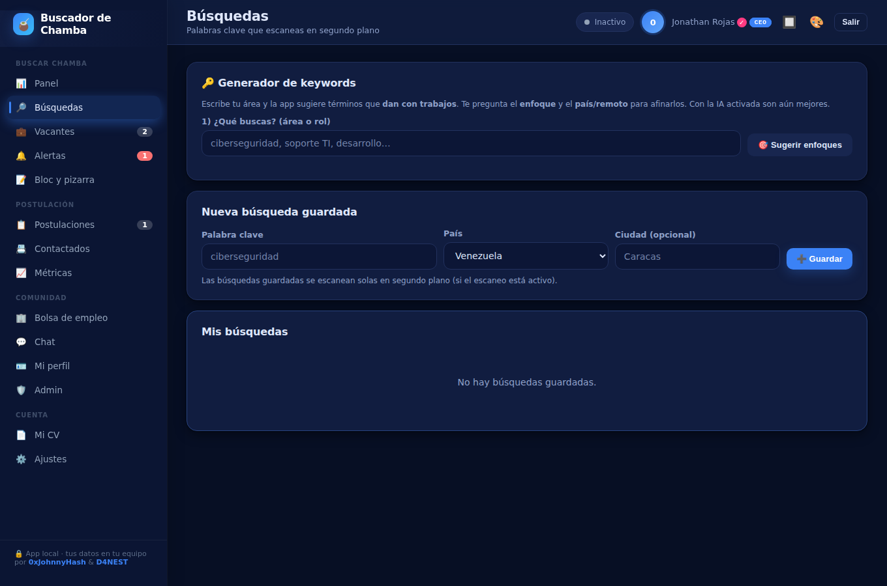
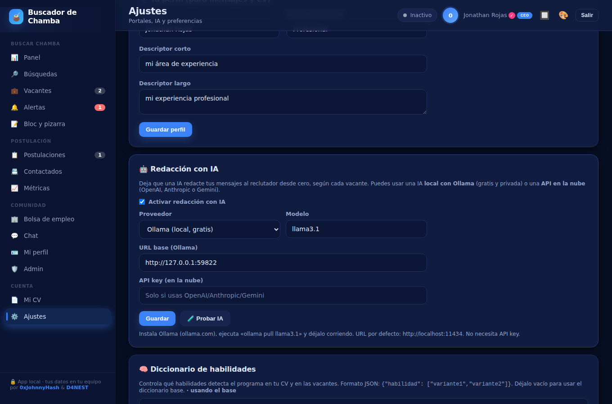

<div align="center">

# Buscador de Chamba

**Plataforma de búsqueda de empleo y comunidad profesional, local y autohospedada.**

Encuentra vacantes en LinkedIn y otros portales, evalúa tu CV (con IA o sin ella), redacta el mensaje al reclutador, organiza tus postulaciones en un tablero, y súmate a una comunidad con perfiles, chat por salas, bolsa de empleo y administración de usuarios.


Desarrollado por **[@0xJohnnyHash](https://github.com/0xJohnnyHash)** y **[@D4NEST](https://github.com/D4NEST)**



</div>

---

## Descripción

Buscador de Chamba es una aplicación web que corre en tu propio servidor. Comenzó como una herramienta personal de búsqueda de empleo y hoy incluye además una capa comunitaria multiusuario. Todos los datos se guardan localmente (SQLite y archivos en disco); no dependen de servicios de terceros.

Como incorpora chat, bolsa de empleo y perfiles, está pensada para ejecutarse en tu red local o en un servidor que administres. Dentro de la comunidad, el perfil y el CV de quien se postula son visibles para la empresa a la que se postula: ese es el propósito de la bolsa.

---

## Funciones principales

### Búsqueda de empleo
- Búsqueda multi-portal (LinkedIn, RemoteOK, Remotive, Arbeitnow, Adzuna y feeds RSS) con deduplicación.
- Escaneo automático en segundo plano de tus búsquedas guardadas.
- Generador de keywords que **analiza vacantes reales** (scraping de títulos) para sugerir términos que sí encuentran trabajos, preguntando el enfoque y el país o remoto. Con una API de IA configurada, además los localiza y amplía.
- Marca de "nueva chamba" para las vacantes recién encontradas, buscador instantáneo por nombre y filtros por portal, salario, fecha, favoritas, estado y etiquetas.

### Evaluación de CV
- Puntuación 0–100 de cada vacante contra tu CV, con análisis de coincidencias y brechas.
- **Con IA:** si cargas una API key (o usas Ollama local), la evaluación del CV la realiza el modelo de IA. **Sin key:** la evaluación es totalmente offline (TF-IDF + diccionario de habilidades).
- Optimización del CV para ATS conservando el formato del `.docx`, y perfiles múltiples de CV.
- Preparación de entrevista, requisitos vs. tu perfil, y skills recomendadas a aprender.

### Contacto y postulación
- Mensaje al reclutador redactado por IA según cada vacante y tu perfil, con idioma (español/inglés), tono, palabras a resaltar y generación de tres variantes. Plantillas como respaldo cuando no hay IA.
- Carta de presentación, enlaces a decisores y aplicación asistida (prepara CV, carta y mensaje).
- Tablero Kanban con estado sincronizado en la lista de vacantes, favoritas, notas, etiquetas, archivado, recordatorios de entrevista y de seguimiento, y meta semanal.

### Comunidad
- **Perfil de usuario** con foto, titular, biografía, ubicación y enlaces, más un onboarding guiado que hace preguntas; la IA puede redactar la biografía.
- **Roles y verificación:** usuario, empresa, moderador, administrador y dueño (CEO). Un administrador verifica cuentas y asigna roles; el dueño gestiona a los administradores. La cuenta dueño (`0xJohnnyHash`) queda como CEO verificado.
- **Panel de administración** para verificar usuarios y cambiar roles.
- **Chat por salas:** un canal `#general` y canales por país, con creación de salas, lista de usuarios conectados, y badges de verificación y rol junto a cada nombre. Solo las cuentas verificadas escriben; los moderadores y administradores moderan.
- **Mensajes privados** y **amigos:** agrega a alguien desde su perfil (en el chat o en la bolsa), acepta solicitudes y conversa en privado.
- **Bolsa de empleo:** las cuentas de tipo empresa publican vacantes; cualquier usuario verificado se postula, y la empresa ve directamente el perfil y el CV del postulante.
- Los administradores, moderadores y el CEO pueden **elegir el color de su palomita de verificación**.

### Alertas, métricas e integraciones
- Alertas cuando una vacante supera tu umbral de match, con aviso de escritorio, correo y Telegram.
- Resumen diario o semanal por correo o Telegram.
- Métricas de conversión (embudo y tasa de respuesta) y exportación a Excel y CSV.

### Personalización
- Interfaz oscura de estética hacker, con un **fondo animado tipo galaxia/olas** (nebulosa, rejilla técnica y línea de escaneo) que se **recolorea según el tema** activo.
- **Cursor personalizado** negro con detalles del color del tema.
- El **logo va rotando entre iconos tecnológicos** (🔎, 🛰️, 🧠, ⚙️, 🔐…) con cada escaneo automático.
- 28 temas incluidos (azul por defecto, SOC/Hacker, Tokyo Night, Catppuccin, One Dark, GitHub Dark, Nord, Drácula, y más), generador de temas aleatorio y creador de temas propio guardado en tu cuenta.
- Favicon personalizable desde la carpeta `static/`.

---

## Capturas

| Vacantes | Detalle de vacante |
|:---:|:---:|
|  |  |

| Chat por salas | Bolsa de empleo |
|:---:|:---:|
|  |  |

| Panel de administración | Perfil de usuario |
|:---:|:---:|
|  |  |

| Generador de keywords | Ajustes |
|:---:|:---:|
|  |  |

---

## Instalación

Requiere **Python 3.8 o superior**.

```bash
git clone https://github.com/0xJohnnyHash/buscador-de-chamba.git
cd buscador-de-chamba

python -m venv .venv
# Windows:      .venv\Scripts\activate
# macOS/Linux:  source .venv/bin/activate

pip install -r requirements.txt
python app.py
```

Se abre en `http://127.0.0.1:5000`. Por defecto el servidor también escucha en la red local, de modo que otros equipos entran por `http://TU_IP_LOCAL:5000` (la consola muestra la dirección). Para limitarlo solo a tu equipo, arranca con `HOST=127.0.0.1 python app.py`. El puerto se cambia con `PORT`.

### Cuenta dueño (CEO)

La cuenta dueño es la definida en la constante `OWNER_USERNAME` de `app.py` (viene como `0xJohnnyHash`). Regístrate con ese usuario exacto y tu cuenta será dueño, verificada y con distintivo de CEO automáticamente. Si prefieres otro nombre, cámbialo en esa constante antes de registrarte.

Desde **Admin** verificas cuentas y asignas roles. Solo las cuentas verificadas pueden escribir en el chat, enviar mensajes privados y postularse; las de tipo empresa pueden publicar vacantes.

### Redacción y evaluación con IA (opcional)

En **Ajustes → Redacción con IA** elige el motor:

- **Ollama (local, gratuito y privado):** instala [Ollama](https://ollama.com), ejecuta `ollama pull llama3.1` y déjalo activo. No requiere API key.
- **API en la nube:** OpenAI, Anthropic o Gemini; introduce tu API key y el modelo.

Con la IA activa, el mensaje al reclutador, la biografía del perfil, las keywords y la **evaluación del CV** usan el modelo. Sin key configurada, todo funciona en modo offline.

### Favicon

Coloca tu icono en `static/` con el nombre `favicon.png` (o `.ico` / `.svg`). Ver `static/LEER_FAVICON.txt`.

---

## Tecnologías

- **Backend:** Python, Flask, SQLite (un solo `app.py`).
- **Frontend:** HTML, CSS y JavaScript sin frameworks (una sola página).
- **Documentos:** python-docx (CV `.docx`), openpyxl (Excel).
- **IA (opcional):** Ollama, OpenAI, Anthropic, Google Gemini o cualquier endpoint compatible con OpenAI.
- **Notificaciones:** escritorio (plyer), correo (SMTP) y Telegram.
- **Fuentes de vacantes:** LinkedIn (endpoint público de invitado), RemoteOK, Remotive, Arbeitnow, Adzuna y RSS.

---

## Estructura del proyecto

```
buscador-de-chamba/
├── app.py                # Backend Flask: API, base de datos, escáner, scoring, comunidad
├── templates/
│   └── index.html        # Interfaz completa (una sola página)
├── static/               # Favicon y estáticos personalizables
├── extension/            # Extensión de navegador (autorrelleno de formularios)
├── screenshots/          # Imágenes del README
├── avatars/              # Fotos de perfil (no se versionan)
├── requirements.txt
├── SUBIR_A_GITHUB.txt    # Guía para publicar en GitHub
├── LICENSE
└── README.md
```

Los datos locales (`vacantes.db`, `users.txt`, `.secret`, CVs y avatares) se generan al usar la app y están en `.gitignore`.

---

## Aviso

Proyecto de uso personal y educativo. Emplea endpoints y APIs públicas de los portales, que pueden cambiar o limitarse; úsalo con moderación y respetando sus Términos de Servicio. La aplicación no guarda contraseñas de portales de empleo ni se postula en tu nombre sin tu confirmación.

Sobre el CV optimizado para ATS: reincorpora, con el vocabulario de la vacante, las palabras clave que realmente posees. Las que faltan se muestran como sugerencias; inclúyelas solo si son ciertas.

---

## Licencia

Distribuido bajo licencia **MIT**. Consulta el archivo `LICENSE`.

<div align="center">

Desarrollado por **[@0xJohnnyHash](https://github.com/0xJohnnyHash)** y **[@D4NEST](https://github.com/D4NEST)**

</div>
